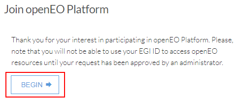
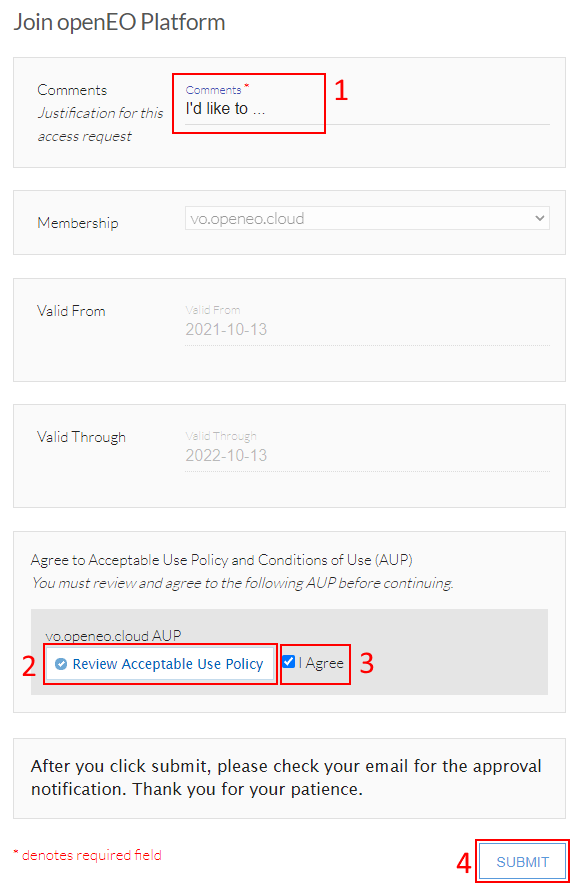

# Registration and Login (Authentication)

To log in to the openEO platform or related services,
you usually do not need to pick a username and invent a new password. 
Instead, we rely on the authentication service [EGI check-in](https://www.egi.eu/services/check-in/),
provided by the [EGI Foundation](https://egi.eu). 
It allows you to login through an existing account from either your institution,
or other commonly used services such as Google, GitHub, Facebook or LinkedIn.

::: tip Some background on Security & Privacy
This procedure has important advantages for our users:

- Neither openEO platform nor the EGI Foundation see, handle or store your password.
  That information is only exchanged directly with your institution or the service selected, 
  to minimize the risk of leaking sensitive credentials.
- openEO platform only retains minimal information about its users,
  such as an email address and a few more general attributes.
:::

## Connect an existing account

The first step is to connect your existing account with EGI check-in.
If you already have done this in the past, you can directly skip this step and 
continue with [joining openEO Platform](#join-openeo-platform).

Otherwise, please go to <https://aai.egi.eu/signup> and select '*SIGN UP*'.
In the next step, select the institution (recommended) or service you want to login with in the future.

::: warning Recommendation
We recommend to use your institutional account whenever possible.
Nevertheless, if you are the first member of your institution to work with EGI check-in, 
problems may occur and sometimes require your institution's IT team to properly
support EGI check-in through EduGain. For any question ragrding this procedure,
please contact `support <at> egi.eu`.
:::

Afterward, you will have to complete a small registration procedure to connect your account.
You may have to fill any missing personal information: *Name*, *Email*, *Affiliation* and/or *Organisation*.

You can find more information about the registration procedure in the [EGI Documentation](https://docs.egi.eu/users/check-in/signup/).
If problems occur during this process, you will want to send a support request to `support <at> egi.eu`.

## Join openEO Platform

Once you have connected your existing account with EGI check-in, you'll need to
become part of the openEO Platform virtual organization.

::: danger Testing phase
Currently, openEO Platform is only open for Early Adopters.
Read more about the Early Adopters program on the [information page](https://openeo.cloud/early-adopters/).
:::

To get started, please [apply to the openEO Platform virtual organization](https://aai.egi.eu/registry/co_petitions/start/coef:327).
You may be asked to log in again with the account you have previously connected to EGI check-in.

::: tip Note
The instructions below are available in English, but may be localized to your preferred language.
:::

Once you are logged in, a registration form with the title '*Join openEO Platform*' will show up,
which you can start by clicking '*BEGIN*'.

<figure>
    
    <figcaption>Joining openEO Platform: Step 1</figcaption>
</figure>

In the next step, you will only be required to fill in two fields:
- *Justification for this access request*: Please provide your brief motivation in this field (1).
- *Agree to Acceptable Use Policy and Conditions of Use (AUP)*: You will need to read (2) and accept (3) the AUP.

You can finalize the registration form by clicking '*SUBMIT*' (4).

<figure>
    
    <figcaption>Joining openEO Platform: Step 2</figcaption>
</figure>

After enrollment, a manual approval will take place and if possible, you will be granted access to the platform.
This process may take a few days, especially if there is high demand.
You will receive an e-mail notification once your account is fully set up and ready to use. 

If you have any questions about the enrollment to openEO Platform or the Early Adopter program,
please [contact us](https://openeo.cloud/contact/).

### Register with Terrascope and EODC

Due to the federated nature of openEO Platform, you still need to also register
with Terrascope and EODC, depending on which data sets and processes you need to use.
This is only required temporarily and this requirement will go away in the future.

#### Terrascope registration

To get optimal access to the processing resources of the Terrascope back-end,
you have to setup a *Terrascope account*.
Luckily, Terrascope also uses the EGI check-in as authentication service,
so you can quickly use your existing account to bootstrap a new Terrascope account.

::: tip Note
If you already have an existing Terrascope account, you can also link your account to it,
which should happen automatically (based on a common email address) if you follow the procedure below.
:::

Go to the [Terrascope portal](https://terrascope.be) to set up the Terrascope account,
click the '*sign in*' menu item at the top, and pick the '*EduGAIN and social logins*' to log in.
After a one time registration process you should have access to all Terrascope services
using your institution or social media credentials.

#### EODC registration

You need to be white-listed to use EODC services.
Please [contact EODC](https://openeo.cloud/contact/) for being white-listed.

## Working with openEO platform

After you've been approved to join openEO Platform, you can start working with
the platform through any of the clients. With all clients you will need to connect to
`https://openeo.cloud` and then authenticate through EGI check-in with the 
account used above.

See the getting started guides to find out more about how to use the clients for this:

* [Editor](../getting-started/editor/index.md)
* [JavaScript](../getting-started/javascript/index.md#authentication)
* [JupyterLab](../getting-started/jupyterlab/index.md)
* [Python](../getting-started/python/index.md#authentication)
* [R](../getting-started/r/index.md#authentication)

 