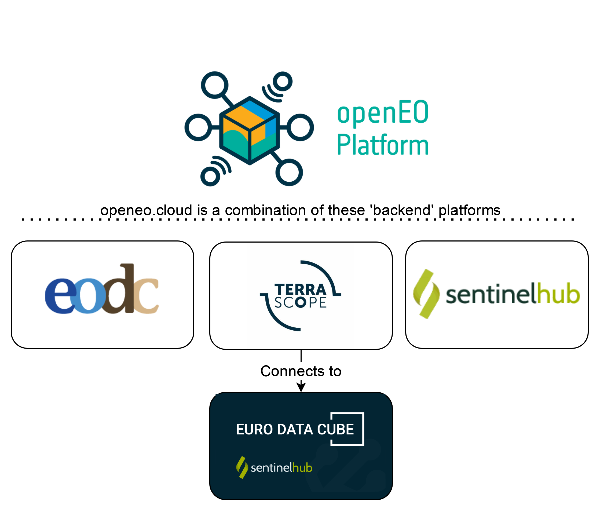

# Federation Aspects and Known Issues

openEO Platform is a federated platform. This means that multiple independent 'back-ends', 
which all support the openEO interface, are combined into a single instance. From the outside, 
it appears to be a single platform, but you get access to data collections and processing resources from 
multiple instances.

This image gives you a look at platforms that make up the federation:



At this time, the federation can not yet entirely hide the fact that it is built out of 
separate components:

- Within the same processing request, you can only use collections from the same back-end
- Some processes are not (fully) supported by all back-ends.
- If a back-end requires data from an external source, bandwidth limitations may result in slower processing.

## Data Collections

The federation exposes the _union_ of the data collections of each of the underlying back-ends.
When a processing request is submitted to the federated platform, the input collections are used to determine to which back-end the actual processing work should be delegated to.

::: tip Note
For the technical discussion on collection federation, see [Open-EO/openeo-aggregator#5](https://github.com/Open-EO/openeo-aggregator/issues/5)
:::

### Terrascope

Terrascope hosts a number of collections itself.
For coarse resolution data (e.g. 100 m resolution) this is often the full archive, 
while for medium resolution (Sentinel 1, 2) data is only offered for selected areas.

Additional data can be processed upon request, if it is not available from another provider. 
This may result in an additional cost for processing and storage.

### Sentinel Hub

The Terrascope back-end also integrates with Sentinel Hub (part of Euro Data Cube) to give you
access to additional collections. 
This practically means that data needs to be transferred from Sentinel Hub to the Terrascope data center before it can be processed.
This works very well for small areas, or a 100x100km MGRS tile in batch mode, 
but is not yet recommended for processing medium size to large countries or continents. 

The collection metadata of the Terrascope back-end tries to clearly identify which collections are served by Sentinel Hub.

#### Commercial Data

openEO Platform provides direct access to commercial data. Currently, data must be purchased directly through Sentinel Hub (see Sentinel Hub documentation on purchasing commercial data [here](https://docs.sentinel-hub.com/api/latest/api/data-import/)), but we are working to support ordering commercial data directly from the platform in the future. 

::: tip Experimental usage
The below described way of how to connect to commercial data is currently only supported by the pyhton client and experimental. As such the behavior might still change in the future.
:::

Data is accessed as part of the load_collection process and via a `featureflags` argument. To access the data, you must:
- select the commercial data provider in `collection_id` (e.g. `collection_id="PLANETSCOPE"`)
- set the Sentinel Hub BYOC collection ID (`byoc-{id}`) as `featureflags` argument (e.g. `datacube._pg.arguments['featureflags'] = {'byoc_collection_id': byoc_collection_id}`)

Full example of loading a commercial data collection:

```python
toc = connection.load_collection(
    collection_id="PLANETSCOPE",
    spatial_extent={"west": 104.86, "south": 8.85, "east": 106.11, "north": 10.37},
    temporal_extent=["2019-03-01", "2020-12-31"],
    bands=["B3"]
)

toc._pg.arguments['featureflags'] = {'byoc_collection_id': byoc_collection_id}
```

List of currently supported commercial data providers:
- PlanetScope (ID: [PLANETSCOPE](https://openeo.cloud/data-collections/view/?id=PLANETSCOPE))

### EODC

EODC provides Sentinel-1 (GRH), Sentinel-2 and Sentinel-3 Level-1 globally. On top, pre-processed Level-2 data is
available on request (this may result in additional costs). In detail Gamma0 data processed with SNAP and optical ARD
products processed with FORCE are provided.

If the available pre-processed collections are not sufficient, there is on option to perform ARD processing on demand
with SNAP respectively FORCE. This may again result in additional costs for processing and storage.

Currently most processes are only available for Level-2 data. Only the ARD processes can be executed on Level-1 data. Also
only either ARD processes **or** "standard" processes can be used in one process graph. Combining both types of processes
is not yet supported. One option to nevertheless achieve a combination of process types is to run ARD on Level-1 data,
save the results of the job, and then in a second job load results and perform additional computations.

## Processes

Each of the underlying back-ends of the federation can define its own set of available processes,
but there is in practice a very large common ground across these back-ends.
As such, the federation's listing of available processes is the _intersection_
of the process sets of each of the underlying back-ends.
This is the most straightforward combination with the least surprise.

::: tip Advanced/experimental usage
A savvy user that knows which underlying back-end will execute their job
can however still submit process graphs with processes that are available
on that back-end but fall outside the intersection,
as the federation will just forward the process graph as-is to that back-end.
:::

::: tip Note
For the technical discussion on process federation, see [Open-EO/openeo-aggregator#4](https://github.com/Open-EO/openeo-aggregator/issues/4)
:::

## File formats

The federation currently lists the _union_ of import/export file formats available
at each of the underlying back-ends.

::: tip Note
For the technical discussion on file format federation, see [Open-EO/openeo-aggregator#1](https://github.com/Open-EO/openeo-aggregator/issues/1)
:::

## Registration

Due to the federated nature of openEO Platform, 
you may still want to register with an individual service provider,
for example to get direct support or better resource prioritization.
This depends on which [data sets](../data-collections/index.md) and [processes](../processes/index.md) you need to use.

### Terrascope Registration

If you plan to use any [data set](../data-collections/index.md) that is *'provided by Terrascope'* or *'provided by Sentinel Hub'*,
you can follow the steps below to set up a *Terrascope account*,
which helps to prioritize and speed up the processing requests.

Luckily, Terrascope also uses the EGI check-in as authentication service,
so you can quickly use your existing EGI account from the 
[Free Tier](../../join/free_tier.md) or the [Early Adopter program](../../join/early_adopter.md)
to bootstrap a new Terrascope account.

::: tip Note
If you already have an existing Terrascope account, you can also link your EGI account to it,
which should happen automatically (based on a common email address) if you follow the procedure below.
:::

Go to the [Terrascope portal](https://terrascope.be) to set up the Terrascope account,
click the '*sign in*' menu item at the top, and pick the *'EduGAIN and social logins'* to log in.
After a one-time registration process, you should have access to all Terrascope services
using your institution or (social) platform credentials.


## Batch jobs

As discussed above, when the federated platform receives a processing request, such as a batch job, 
it will automatically determine to which back-end this request should be delegated for actual processing.

### Managed job splitting

In addition to this basic delegation feature, the federation also provides more advanced (pre)processing capabilities.
For instance, the federation platform can be instructed to split up a single batch job in multiple sub-jobs
and distribute these across one or more processing back-ends.
The federation platform will automatically create, start and keep track of these sub-jobs
while the user just have to interact with a single job: e.g. check the overall processing status,
download the combined result assets, ...

Currently, spatial tile-based splitting is supported as splitting strategy
and it can be enabled by providing a specific job option when submitting the batch job.
For example, using the openEO Python Client, instruct the federation platform to
split up datacube processing in UTM based tiles of 20km by 20km:


```python
job = datacube.create_job(
    job_options={"tile_grid": "utm-20km"}
)
```

This creates a virtual master job on the level of the federation platform and real batch jobs
on the appropriate processing back-ends.
Subsequent interaction (starting the jobs, polling their status, requesting the result assets, ...)
can be done through the "master" `job` object created above, in the same way as with normal batch jobs.

### Validity signer URLs (Batch job results)

Batch job results are accessible to the user via signed URLs stored in the result assets. Within the platform, 
these URLs have a validity (expiry time) of 7 days. Within these 7 days, the results of a batch job can be accessed 
by any person with the URL. Each time a user requests the results from the job endpoint (`GET /jobs/{job_id}/results`), 
a freshly signed URL (valid for 7 days) is created for the result assets.