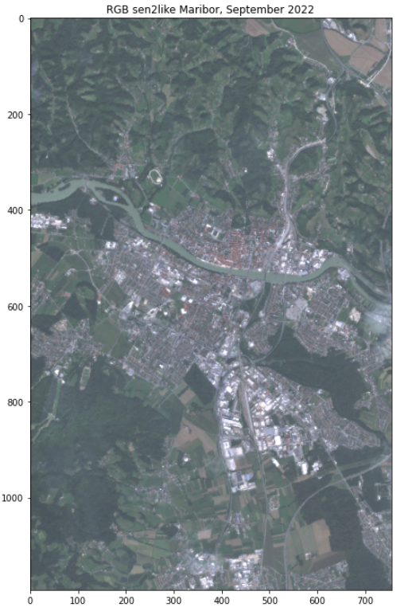
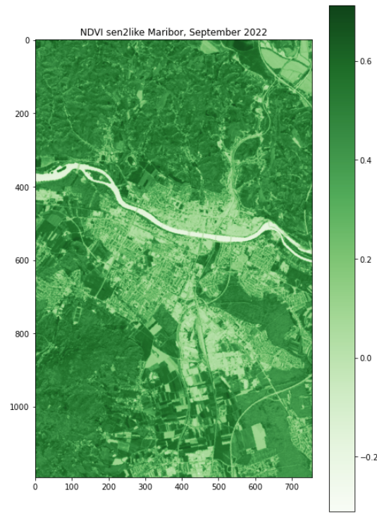
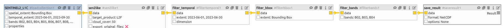

# Sen2Like


::: warning Warning
To use this service, you have to be registered at openEO platform. If you are not yet registered, you can apply [here](https://openeo.cloud/#plans).
:::

The sen2like processor was developed by ESA as part of the [EU Copernicus program](https://www.copernicus.eu/en). It creates Sentinel-2 like (Level-2F) fused surface reflectances by harmonizing Sentinel-2 and Landsat 8/Landsat 9 to increase the temporal revisits. Based on the resulting L2F product, multiple indices can be computed, such as the NDVI and LAI.
The fusion also involves the upscaling of Landsat 8/Landsat 9 data to Sentinel-2 resolution. The Level 2F includes Blue, Green, Red Landsat 8 image bands rescaled to 10.0 m pixel spacing.


[openEO](https://openeo.cloud/) provides an option to run the sen2like processor on the requested extent on an openEO backend. The backend takes care of getting the required input data and the computational resources to run sen2like on. openEO users can start sen2like jobs on the backend and download the results.

This document describes how to use the sen2like processor in OpenEO for a requested spatio-temporal extent. We’ve prepared a [Jupyter Notebook]( https://github.com/eodcgmbh/sen2like/blob/master/openeo/openeo-sen2like.ipynb) that you can use to run the process.


## 1. sen2like for RGB

### openEO sen2like processing

To start the sen2like openEO processing, we need to connect to the EODC openEO backend. 

```python
import openeo
from openeo.rest.datacube import PGNode, THIS

eodc = "https://openeo.eodc.eu/openeo/1.1.0/"

conn = openeo.connect(eodc).authenticate_oidc()

conn.describe_process("sen2like")
```

As sen2like can only process `SENTINEL2_L1C` data, we chose this as our collection and specify the spatial and temporal extent and the bands to compute. Here we chose the Band 02, Band 03 and Band 04 as they are the bands for true Colors (RGB).
The sen2like processing automatically includes the Landsat 8 & 9 data into the computation, so we do not need to call it explicitely. The processing also automatically includes other additional data, such as the digital elevation model and data from the Copernicus Atmosphere Monitoring Service.

We aditionally set the parameters:

- target_product: can be L2F or L2H, usually L2F as it is the 'final' fused product
- cloud_cover: is between 1 and 100. A high cloud cover can make data inaccurate, so we ignore files with a higher cloud cover than 50%.
- export_original_files: can be True or False - if True, the .SAFE folders are an output of the openEO process as well.

```python
collection      = 'SENTINEL2_L1C'
spatial_extent  = {"west": 15.6, "east": 15.7, "south": 46.5, "north": 46.6}
temporal_extent = ["2023-07-01", "2023-09-30"]
bands = ["B02", "B03", "B04"]

S2 = conn.load_collection(collection, spatial_extent=spatial_extent, temporal_extent=temporal_extent, bands=bands)
sen2like = S2.process('sen2like', {
    'data': THIS,
    'target_product': 'L2F', 
    'export_original_files': True,
    'cloud_cover': 50}) 
```

Additionally, we can make use of other openEO processes. Here, the data is aggregated to produce monthly means and stored in NetCDF files.

```python
sen2like_month = sen2like.aggregate_temporal_period(reducer="mean", period="month")

sen2like_nc = sen2like_month.save_result(format="NetCDF")
```


We create and start the openEO job.
To reuse the results without uploading them again, we need to know the job id. To see the job status the job.status() function has to be called.

```python
job = sen2like_nc.create_job().start_job()

job.status()
```

When the job is finished, the results can be downloaded.

```python
results = job.get_results()
metadata = results.get_metadata()
```


### Explore the openEO L2F results

To create a plot of our data, we need the libraries numpy, xarray and matplotlib.pyplot. First, the desired data set must be selected.

```python
data = xr.open_mfdataset("EU010M_E051N014T1_20230930T000000.nc")
```

To get a true color image the colors need to get adjusted. Then, we can plot our data.

```python
brg = np.zeros((data.B04.shape[0],data.B04.shape[1],3))
brg[:,:,0] = (data.B04.values+1)/15
brg[:,:,1] = (data.B03.values+1)/14
brg[:,:,2] = (data.B02.values+1)/11.6
brg = np.clip(brg,0,255).astype(np.uint8)

plt.figure(figsize=(8,12))
plt.title("RGB sen2like Maribor, September 2022")
plt.imshow(brg,cmap='brg')
```




## 2. sen2like for NDVI

The Normalized difference vegetation index is a metric for quantifying the health and density of vegetation using eo data.
First, we need to add the connection of the EODC backend as described above.

```python
import openeo
from openeo.rest.datacube import PGNode, THIS

eodc = "https://openeo.eodc.eu/openeo/1.1.0/"

conn = openeo.connect(eodc).authenticate_oidc()

conn.describe_process("sen2like")
```

To calculate the NDVI the red band (04) and the band for the near infrared (08) are needed. The other values are the same as above.

```python
collection      = 'SENTINEL2_L1C'
spatial_extent  = {"west": 15.6, "east": 15.7, "south": 46.5, "north": 46.6}
temporal_extent = ["2023-09-01", "2023-09-30"]
bands = ["B04", "B08"]

S2 = conn.load_collection(collection, spatial_extent=spatial_extent, temporal_extent=temporal_extent, bands=bands)
sen2like = S2.process('sen2like', {
    'data': THIS,
    'target_product': 'L2F', 
    'export_original_files': False,
    'cloud_cover': 50}) 
```

Additionally, we can make use of other openEO processes. The nir and red bands of the data are combined to the NDVI and stored in NetCDF files.

```python
sen2like_ndvi = sen2like.ndvi(nir="B08", red="B04")

sen2like_nc = sen2like_ndvi.save_result(format="NetCDF")
```

We create and start the openEO batch job:

```python
job = sen2like_nc.create_job().start_job()
job.status()
```

When the job is finished, the results can be downloaded.

```python
results = job.get_results()
metadata = results.get_metadata()
```

### Explore the openEO L2F NDVI results

Here, we only need to load the data and plot the results.

```python
data = data.name

plt.figure(figsize=(8,12))
plt.title("NDVI sen2like Maribor, September 2022")
plt.imshow(data,cmap='Greens')
plt.colorbar()
```





## 3. Sen2Like processing in the openeo web editor

The [openEO web editor](https://editor.openeo.org/?server=https%3A%2F%2Fopeneo.eodc.eu%2Fopeneo%2F1.1.0) is another way to use the Sen2Like processor. To interact with the server, you need to log in first.

When the editor is opened, you can see all previous batch jobs at the bottom, all available collections and processes on the left hand side and the main editor window on the top right side of the window. You can build your own graphs by connecting collections and processes.

The processing graph for the Sen2Like processor looks like this:


The structure is the same as in the notebooks. First, the Sentinel-2 data is selected. Then the Sen2Like process is executed, which is then filtered by time, extent and bands. The new data is then saved and can be used individually.

Below the graph, you can switch between the `Visual Model` and `Code`. The Visual Model is the processing graph and Code is the JSON code of the built processing graph and can also be customized. The processing graph then automatically updates again.

The JSON Code for Sen2Like looks like this.

```
{
  "process_graph": {
    "loadcollection1": {
      "process_id": "load_collection",
      "arguments": {
        "bands": [
          "B02",
          "B03",
          "B04",
          "B05",
          "B06",
          "B07",
          "B08",
          "B8A",
          "B11",
          "B12"
        ],
        "id": "SENTINEL2_L1C",
        "spatial_extent": {
          "west": 15.2,
          "east": 17.6,
          "south": 47.9,
          "north": 49.5
        },
        "temporal_extent": [
          "2023-06-01",
          "2023-09-30"
        ]
      }
    },
    "sen2like1": {
      "process_id": "sen2like",
      "arguments": {
        "data": {
          "from_node": "loadcollection1"
        }
      }
    },
    "filtertemporal1": {
      "process_id": "filter_temporal",
      "arguments": {
        "data": {
          "from_node": "sen2like1"
        },
        "extent": [
          "2023-06-01",
          "2023-06-30"
        ]
      }
    },
    "filterbbox1": {
      "process_id": "filter_bbox",
      "arguments": {
        "data": {
          "from_node": "filtertemporal1"
        },
        "extent": {
          "west": 16.6,
          "east": 16.7,
          "north": 48,
          "south": 47.9
        }
      }
    },
    "filterbands1": {
      "process_id": "filter_bands",
      "arguments": {
        "bands": [
          "B02",
          "B03",
          "B04"
        ],
        "data": {
          "from_node": "filterbbox1"
        }
      }
    },
    "saveresult1": {
      "process_id": "save_result",
      "arguments": {
        "data": {
          "from_node": "filterbands1"
        },
        "format": "NetCDF",
        "options": {}
      },
      "result": true
    }
  },
  "parameters": []
}
```


