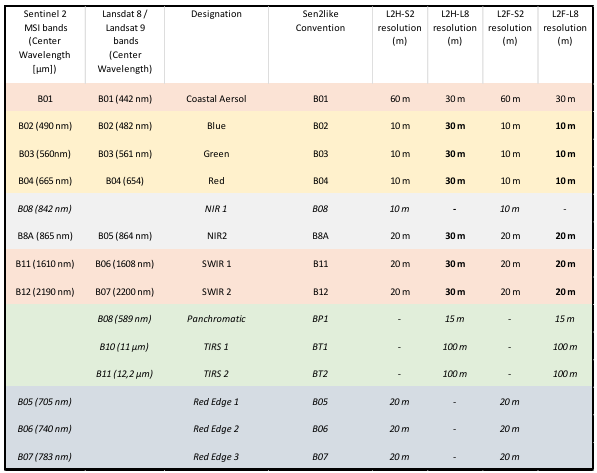

# Sen2like


::: warning Attention
To use this service, you have to be registered at openEO platform. If you are not yet registered, you can apply [here](https://openeo.cloud/#plans).
:::

The sen2like processor was developed by ESA as part of the EU Copernicus program. It creates Sentinel-2 like (Level-2F) fused surface reflectances by harmonizing Sentinel-2 and Landsat 8/Landsat 9 to increase the temporal revisits. Based on the resulting L2F product, multiple indices can be computed, such as the NDVI and LAI.
The fusion also involves the upscaling of Landsat 8/Landsat 9 data to Sentinel-2 resolution. The Level 2F includes Blue, Green, Red Landsat 8 image bands rescaled to 10.0 m pixel spacing.




This document describes how to use the sen2like processor in OpenEO for a requested spatio-temporal extent. We’ve prepared a [Jupyter Notebook]( https://github.com/eodcgmbh/sen2like/blob/master/openeo/openeo-sen2like.ipynb) that you can use to run the process.


## 1. data preparation

To start the sen2like openEO processing, first we need to connect to the openEO backend.

```python
import openeo
from openeo.rest.datacube import THIS
from openeo.processes import *

conn = openeo.connect("openeo.cloud").authenticate_oidc()
```


As sen2like can only process `SENTINEL2_L1C` data, we chose this as our collection and specify the spatial and temporal extent and the bands to compute. 
The sen2like processing automatically includes the Landsat 8 & 9 data into the computation, so we do not need to call it explicitely. The processing also automatically includes other additional data, such as the digital elevation model and data from the Copernicus Atmosphere Monitoring Service.

```python
spatial_extent = {"west": 15.2, "east": 17.6, "south": 47.9, "north": 49.5}
temporal_extent = ["2023-06-01", "2023-09-30"]

collection      = 'SENTINEL2_L1C'
bands = ["B02", "B03", "B04", "B05", "B06", "B07", "B08", "B8A", "B11", "B12"]

S2 = conn.load_collection(
    collection, 
    spatial_extent=spatial_extent, 
    temporal_extent=temporal_extent, 
    bands=bands)
```


## 2. Sen2like processing

Here, we apply the sen2like processing. The `export_original_files`-parameter has to be true to specify the L2F. A high cloud cover can make data inaccurate, so we ignore files with a higher cloud cover than 50%.

```python
sen2like = S2.process('sen2like', {
    'data': THIS,
    'target_product': 'L2F', 
    'export_original_files': True,
    'cloud_cover': 50})
```


We select a temporal subset of the data to create an RGB.
RGB stands for red (Band 4), green (Band 3), blue (Band 2) and describes the true colors of an image in remote sensing.

```python
sen2_small = sen2like.filter_temporal(["2023-06-01", "2023-06-30"]).filter_bbox({"west": 16.6, "east": 16.7, "south": 47.9, "north": 48})
rgb = sen2_small.filter_bands(bands=["B02", "B03", "B04"])
```

We save the data into a NetCDF, a file format for storing multidimensional scientific data (variables). Two types of output are created: The sen2like original .SAFE files for the extent of four UTM tiles and the NetCDF for a smaller sector.

```python
rgb_nc = rgb.save_result(format="NetCDF")
```


## 3. Running the Job

We create and start the openEO job.
To reuse the results (e.g. for the [indices notebook]( https://github.com/eodcgmbh/openeo-examples/blob/master/UCs/UC15-indices.ipynb)), we need to know the job id. To see the job status the job-variable has to be called.

```python
job = rgb_nc.create_job().start_job()

job
```


Once the job status is "finished", we can download and explore the results. 
```python
results = job.get_results().download_files("sen2like_outputs")
```

## 4. Explore the openEO results

To create a plot of our data, we need the libraries numpy, xarray and matplotlib.pyplot. First, the desired data set must be selected.

```python
data = xr.open_mfdataset("EU010M_E051N014T1_20230930T000000.nc")
```


## 4. Indices calculations

To calculate some Indices on our L2F data, we’ve prepared another [Jupyter Notebook]( https://github.com/eodcgmbh/openeo-examples/blob/master/UCs/UC15-indices.ipynb). We make use of the "load_stac" process, to reload the previously computed sen2like outputs. This is especially useful, when we compute multiple indices from the same sen2like outputs, as the sen2like processing only needs to be done once.

To load the results, insert the url with the latest "job_id" into the "load_stac" process. The spatio-temporal extent can be the same or smaller/shorter as in the selected data. We select the bands "B03", "B04", "B05", "B06", "B07", "B8A", "B11", "B12", as these are required in the computation for the indices.

```python
sen2like_job_id = "eodc-5d4c1746-33b2-42fb-914c-d36987747ae6"
spatial_extent = {"west": 16.6, "east": 16.7, "south": 47.9, "north": 48}
temporal_extent = ["2023-06-01", "2023-06-30"]
bands = ["B03", "B04", "B05", "B06", "B07", "B8A", "B11", "B12"]

data = conn.load_stac(
    url = f"https://openeo.eodc.eu/openeo/1.1.0/jobs/{sen2like_job_id}/results",
    spatial_extent=spatial_extent, 
    temporal_extent=temporal_extent, 
    bands=bands)
```


### 4.1 Leaf Area Index (LAI)

The LAI process is based on the computation specified at [sentinelhub]( https://custom-scripts.sentinel-hub.com/sentinel-2/lai/). All needed Bands and angles are included in the sen2like output data.

```python
lai = data.process('lai', {'data': data})
lai_nc = lai.save_result(format="NetCDF", options={"tile_grid":"time-series"})
```

We create and start the openEO job. Once the job status is "finished", we can download the results.
```python
job = lai_nc.create_job().start_job()
job.get_results().download_files("./lai/")
```


### 4.2	Leaf Chlorophyll Content (CAB)

With the same input as the LAI, the CAB can be calculated. The processing is based on the computation from [sentinelhub]( https://custom-scripts.sentinel-hub.com/sentinel-2/cab/). 

```python
cab = data.process('cab', {'data': data})
cab_nc = cab.save_result(format="NetCDF", options={"tile_grid":"time-series"})
job = cab_nc.create_job().start_job()
job.get_results().download_files("./cab/")
```

### 4.3	Fraction of green Vegetation Cover

In the same manner, we compute the Fraction of green Vegetation Cover (FCOVER), which is based on the calculations from [sentinelhub](https://custom-scripts.sentinel-hub.com/sentinel-2/fcover/).

```python
fcover = data.process('fcover', {'data': data})
fcover_nc = fcover.save_result(format="NetCDF", options={"tile_grid":"time-series"})
job = fcover_nc.create_job().start_job()
job.get_results().download_files("./fcover/")
```

### 4.4	Fraction of Absorbed Photosynthetically Active Radiation (FAPAR)

The FAPAR computation can be found at [sentinelhub](https://custom-scripts.sentinel-hub.com/sentinel-2/fapar/).

```python
fapar = data.process('fapar', {'data': data})
fapar_nc = fapar.save_result(format="NetCDF", options={"tile_grid":"time-series"})job = job = fapar_nc.create_job().start_job()
job.get_results().download_files("./fapar/")
```

### 4.5	Normalized difference vegetation index

The computation of the indices could also be done in one process graph with the sen2like processing. In this case, we start again with the "load_collection" process and select the bands "B04" and "B08".

```python
spatial_extent =  {"west": 16.6, "east": 16.7, "south": 47.9, "north": 48}
temporal_extent = ["2023-06-01", "2023-09-30"]

collection      = 'SENTINEL2_L1C'
bands = ["B04", "B08"]

S2 = conn.load_collection(
    collection, 
    spatial_extent=spatial_extent, 
    temporal_extent=temporal_extent, 
    bands=bands)
sen2like = S2.process('sen2like', {
    'data': THIS,
    'target_product': 'L2F', 
    'export_original_files': True,
    'cloud_cover': 50})
```

We make use of the "ndvi" process and select a format and options for saving. Then we create and start the job and download the results.

```python
ndvi = sen2like.ndvi(nir="B08", red="B04")
ndvi_nc = ndvi.save_result(format="NetCDF", options={"tile_grid":"time-series"})

job = ndvi_nc.create_job().start_job()
job.get_results().download_files("./ndvi/")
```

### 4.6 Explore the results

The functionality is shown using the LAI, but it works the same for the other indices. To create a plot of the results, we need the libraries os, numpy, mathplotlib and xarray. First, the LAI files are loaded. A map with the results is then created using matplotlib.pyplot.

```python
import os
import numpy as np
import matplotlib.pyplot as plt
import xarray as xr

path = "./lai/"
files = [path+file for file in os.listdir(path) if file.startswith("Time")]
lai = xr.open_mfdataset(files).name
lai = lai.where(lai!=-9999, np.nan)
```
```python
plt.figure(figsize=(10,8))
plt.imshow(lai[0], cmap="YlGn")
plt.colorbar()
```


