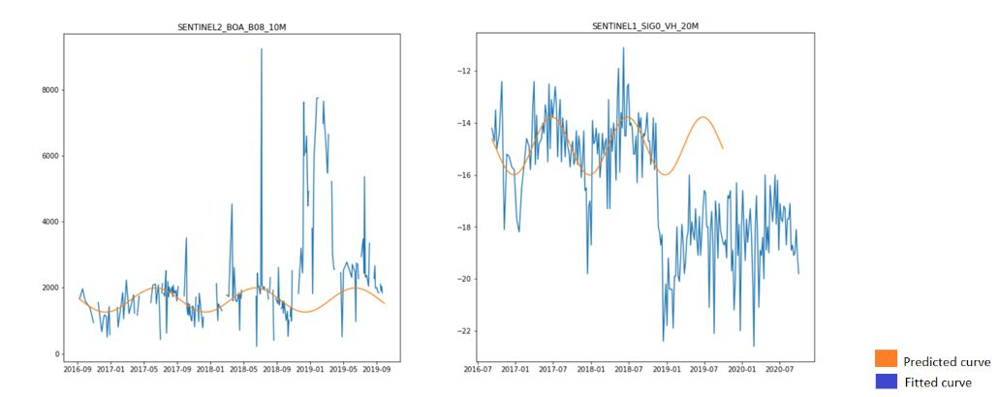
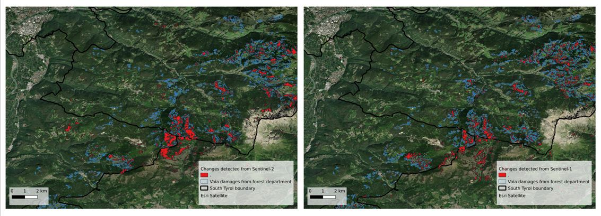

# Forest Change Detection

Spatially and temporally explicit information of forest ecosystems is essential for a broad range of applications and Earth observation has become a key instrument for forest management and for monitoring forest cover dynamics.
Forest change detection tries to identify critical variations in the time series signal, with a strong focus on forests (e.g., illegal deforestation, wind throw, fire). 
Forests follow a seasonal growth: during the summer months, they carry more leaves which leads to higher surface reflectance whereas in winter the reflectance will be much lower. This up and down in the surface reflectance of vegetated areas, can be mapped as a sinusoidal function with peaks in the vegetative periods (summer) and valleys in between. Knowing the shape of this sinusoidal function allow us to inspect disturbances, checking how much the new signal differ from the reference harmonic behavior.

<figure>
    
    <figcaption>Figure 1: Sample result from the curve fitting and prediction steps. In blue the S2 B08 data and in orange the predicted values following the harmonic seasonal function.</figcaption>
</figure>

This approach can be applied to single pixels, looking into a particular area of interest, or more in general over a wide area, where each pixel time series is treated independently.
The following figure shows such pixels with detected change from both Sentinel-1 and Sentinel-2
<figure>
    
    <figcaption>Figure 2: Curve fitting and prediction for Sentinel-1 and Sentinel-2. In blue the S2 B08 and S1SIGÖ VH data and in orange the respective predicted values following the harmonic seasonal function.</figcaption>
</figure>

In this section, we will show how to combine openEO functionality into a basic change detection pipeline.

## Data preparation

To correctly find the right fitting for the harmonic function, we need cloud-free data if using optical data, or shadow masked data if using radar data, over a timeseries of at least two years (but more is better!). Pixels covered by clouds or shadows deviate from the expected trend of the vegetation and therefore we must start with pre-processed data.

The current implementation of the ``fit_curve()`` / ``predict_curve()`` process and available processing and memory resources limit the spatio-temporal extent of data which can be processed in a single job. If a large extent should be processed, the extent has to be split into multiple parts and can be processed in multiple jobs.

## Seasonal curve fitting

Supposing that the training input data is a cloud-free Sentinel-2 timeseries we can write the following code using the openEO clients to find the optimal function coefficients:

<CodeSwitcher>
<template v-slot:py>

```python
import openeo
from openeo.processes import cos, sin, array_element
def fit_function(x:ProcessBuilder, parameters:ProcessBuilder):
    t = 2 * math.pi / 31557600 * x
    return parameters[0] + parameters[1] * cos(t) + parameters[2] * sin(t)

curve_fitting = l2a_bands.fit_curve(
    parameters=[1,1,1], # Initial guess of the parameters
    dimension="t",      # Fit the function along the temporal dimension
    function=fit_function
)
```

</template>

<template v-slot:js>

```js
// 31557600 are the seconds in one year
let fitFunction = new Formula('$$0 + $$1*cos(2*pi()/31557600*x) + $$2*sin(2*pi()/31557600*x)');

curve_fitting = builder.fit_curve(
    l2a_bands,
    [1,1,1], // Initial guess of the parameters
    fitFunction,
    't', // Fit the function along the temporal dimension
);
```

</template>
</CodeSwitcher>

## Predicting values

With the seasonal function coefficients, we can predict the expected value for a particular time step. In the following case, we are computing the values following the seasonal trend for the training time steps:

<CodeSwitcher>
<template v-slot:py>

```python
temporal_labels = l2a_bands.dimension_labels('t')
curve_prediction = l2a_bands.predict_curve(parameters=curve_fitting,dimension='t',function=fitFunction,labels=temporal_labels)
```

</template>

<template v-slot:js>

```js
temporal_labels = builder.dimension_labels(l2a_bands, "t");
curve_prediction = builder.predict_curve(l2a_bands, curve_fitting, fitFunction, 't', temporal_labels);
```

</template>
</CodeSwitcher>

The difference between the training data and the predicted values following the seasonal model is a key information, which is used to perform the change detection with new data. Please have a look at the [reference notebook](https://github.com/openEOPlatform/SRR2_notebooks/blob/main/UC6%20-%20Forest%20Dynamics.ipynb) for the complete pipeline.

The results obtained over an area of South Tyrol in Northern Italy which was hit by the Vaia storm are shown below. Similar damages are detected from Sentinel-1 and Sentinel-2
<figure>
    
    <figcaption>Figure 3: Change detection maps for the Vaia storm from Sentinel-1 and Sentinel-2.</figcaption>
</figure>
