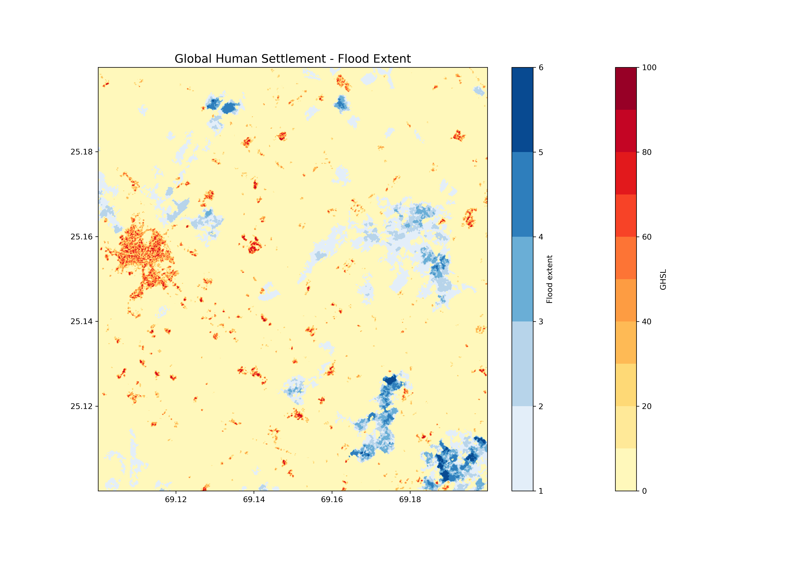
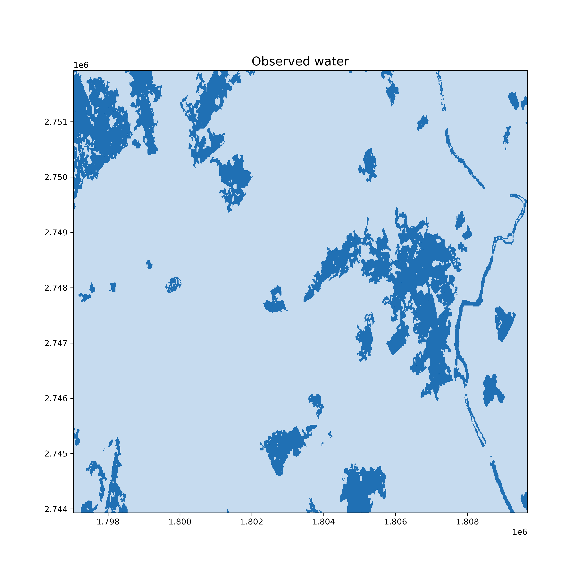

# Global Flood Monitoring

The Global Flood Monitoring (GFM) product is a component of the EU’s Copernicus
Emergency Management Service (CEMS) that provides continuous monitoring of
floods worldwide, by processing and analysing in near real-time all
incoming Sentinel-1 SAR acquisitions over land.

The operational implementation the GFM product includes the following key
elements:
- Downloading of worldwide Sentinel-1 SAR acquisitions (Level-1 IW GRDH)
- Pre-processing of the downloaded Sentinel-1 data to backscatter data (SIG0)
- Operational application of three fully automated flood mapping algorithms.
- An ensemble-based approach is then used to combine the three flood extent
  outputs of the individual flood algorithms.
- Generation of the required GFM output layers, including Observed flood extent,
  Reference water mask, Exclusion Mask and Likelihood Values
- Web service-based access and dissemination of the GFM product output layers

## Output layers used in this notebook
- Observed flood extent (ENSEMBLE of all three individual flood outputs)
- Reference water mask (permament and seasonal water bodies)

## Links
https://extwiki.eodc.eu/GFM

## Compute the maximum flood extent
The sum of flooded pixels over time

<CodeSwitcher>
<template v-slot:py>

```python
spatial_extent  = {'west': 67.5, 'east': 70, 'south': 24.5, 'north': 26}
temporal_extent = ["2022-09-01", "2022-10-01"] 
collection      = 'GFM'

gfm_data = conn.load_collection(
    collection, 
    spatial_extent=spatial_extent, 
    temporal_extent=temporal_extent, 
    bands = ["flood_extent"]
)
gfm_sum = gfm_data.reduce_dimension(dimension="time", reducer=sum)

gfm_sum_tiff = gfm_sum.save_result(format="GTiff", options={"tile_grid": "wgs84-1degree"})
```
</template>
</CodeSwitcher>

## Explore how the flood extent relates to the Global Human Settlement Built-up layer

The Global Human Settlement Layer (GHSL) project produces global spatial 
information about the human presence on the planet over time in the form of 
built-up maps, population density maps and settlement maps.

Here, the GHS-BUILT-S spatial raster dataset at 10m resolution is used which 
depicts the distribution of built-up surfaces, expressed as number of square metres.

Values are between 0 and 100 and represent the amount of square metres of
built-up surface in the cell. 

https://ghsl.jrc.ec.europa.eu/about.php

The GHSL is available in `wgs84`. Therefore, the `tile_grid` for the GFM data was set to `wgs84` as well.

<figure>
    
    <figcaption>Figure 1: Estimate of how the built-up surface was effected by the flood in Pakistan in September 2022.</figcaption>
</figure>

## Observed water (flood_extent + refwater)

The observed water combines both flood extent and the reference water mask. The reference water mask represents permanent or seasonal water bodies, which are clearly distinct from flood events.
With openEO, the two layers `flood_extent` and `refwater` can be combined directly and stored into one file. No need to download layers individually.

<CodeSwitcher>
<template v-slot:py>

```python
spatial_extent  = {'west': 67.5, 'east': 70, 'south': 24.5, 'north': 26}
temporal_extent = ["2022-09-01", "2022-10-01"] 
collection      = 'GFM'

gfm_data = conn.load_collection(
    collection, 
    spatial_extent=spatial_extent, 
    temporal_extent=temporal_extent, 
    bands = ["flood_extent", "refwater"]
)

# retrieve all pixels which have been detected as water during the given period
# -> observed water
observed_water = gfm_data.reduce_dimension(dimension="bands", reducer=any).reduce_dimension(dimension="time", reducer=any)

# Save the result in Equi7Grid and as GeoTiff
observed_water_tif = observed_water.save_result(format="GTiff", options={"tile_grid": "equi7"})
```
</template>
</CodeSwitcher>

## Explore the observed water

The original GFM data is stored on the Equi7 Grid and the Asian Equi7 coordinate reference system. With the `tile_grid` parameter, the user can either keep the data like this, or pick a different CRS.

<figure>
    
    <figcaption>Figure 2: The observed water mask in Pakistan in September 2022.</figcaption>
</figure>
