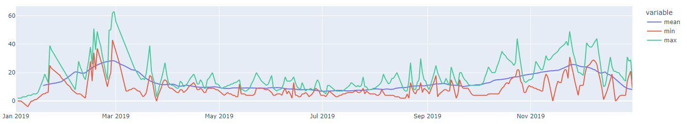

# NO₂ monitoring

[TROPOMI (**TROPO**spheric **M**onitoring **I**nstrument)](https://sentinels.copernicus.eu/web/sentinel/missions/sentinel-5p/instrumental-payload) is the name of a sensor on board of the [Sentinel-5 Precursor (S5P) satellite](https://sentinels.copernicus.eu/web/sentinel/missions/sentinel-5p), developed to monitor atmospheric chemistry.

This use case analyses Sentinel 5P imagery, focusing in particular on NO₂ measurements. Compared to other variables measured by TROPOMI, NO₂ is of high interest not only because of its direct relation with environmental health, but also because the main sources are typically known, because it is not transported over long distances and because the total column values measured by TROPOMI are strong indication of the ground level values.

This document describes how to analyze NO₂ data on openEO Platform using the Python, JavaScript and R client.
Additionally, we've prepared [a basic Jupyter Notebook](https://github.com/openEOPlatform/sample-notebooks/blob/main/sentinel-5p.ipynb) for Python and much more advanced R and Python Shiny apps that you can run to analyze and visualize the NO₂ data in various ways.

## Shiny apps (R and Python)

In the Shiny app the NO₂ values can be analyzed globally over a full year. The analysis allows the user to set threshold values for the cloud cover. Gaps due to the cloud removal are filled by a linear interpolation. Noise gets removed by computing 30-day smoothed values, using kernel smoothing of the time series.

The Shiny app allows for three different modes:
- Time series analysis / comparison against locally measured data
- Map visualization for individual days
- Animated maps that highlight differences in space and time

Currently, the Shiny apps can only run on your local computer but we are looking into offering a hosted version, too. There's also [a guide that explains how to run openEO code in a Python Shiny app in general](../../getting-started/python/shiny.md).

You can find the full source code and documentation of the apps in their respective repositories:

- [R Shiny app repository](https://github.com/Open-EO/r4openeo-usecases/tree/main/uc3-s5p-dashboard)
- [Python Shiny app repository](https://github.com/openEOPlatform/s5p-py-dashboard)

### Time-Series Analyser

The Time-Series Analyser allows one to see the "reduced"  time series (min/max/smoothed mean) of Sentinel 5P NO2 data from a given region. Basically, to use this function, the user can pass the coordinates of the bounding box of the area of interest, which are shown in a dynamic map; but also the time frame and the cloud cover to be considered in the computation. The analyser can also do a comparison against locally measured data (for selected areas only).

### Map Maker for one Snapshot

If the user desires to look at NO2 data at one given point in time, this function is the developed for this purpose. This second  option in the Shiny app allows one to visualize how does a country's pattern in NO2 looks like in a given time, following S5P NO2 data.

### Spacetime Animation

Here, the user can create and visualise their own  spatio-temporal animation of S5P NO2 data. Given a starting and ending  date, as well as the quality flag for cloud cover and a given country  name, the user may have their own personalised spacetime GIF ready for  their usage.


## Basic NO₂ analysis in Python, R and JavaScript

openEO Platform has multiple collections that offer Sentinel-5P data, e.g. for NO₂:
- [TERRASCOPE_S5P_L3_NO2_TD_V1](https://openeo.cloud/data-collections/view/?id=TERRASCOPE_S5P_L3_NO2_TD_V1) - daily, hosted by VITO, pre-processed to remove clouds etc.
- [TERRASCOPE_S5P_L3_NO2_TD_V1](https://openeo.cloud/data-collections/view/?id=TERRASCOPE_S5P_L3_NO2_TM_V1) - monthly, hosted by VITO, pre-processed to remove clouds etc.
- [TERRASCOPE_S5P_L3_NO2_TD_V1](https://openeo.cloud/data-collections/view/?id=TERRASCOPE_S5P_L3_NO2_TY_V1) - yearly, hosted by VITO, pre-processed to remove clouds etc.
- [SENTINEL_5P_L2](https://openeo.cloud/data-collections/view/?id=SENTINEL_5P_L2) - Level 2 data, hosted by Sentinel Hub

`SENTINEL_5P_L2` also contains additional data such as CO, O₂, SO₂ and you can also experiment with those. CO is also available on VITO in Collections such as `TERRASCOPE_S5P_L3_CO_TD_V1`.

In this example we'll use the daily composites from the `TERRASCOPE_S5P_L3_NO2_TD_V1` collection, which is available starting from end of April 2018.

### 1. Load a data cube

::: warning Attention
This tutorial assumes you have completed the Getting Started guides and are connected and logged in to openEO Platform.
Your connection object should be stored in a variable named `connection`.
:::

First of all, we need to load the data into a datacube. We set the temporal extent to the year 2019 and choose spatial extent, here an area over Münster, Germany.

<CodeSwitcher :languages="{py: 'Python', js: 'JavaScript', r: 'R'}">
<template v-slot:py>

```python
year = 2019
extent = { # Münster
    "type": "Polygon",
    "coordinates": [[
        [7.737228350528245,51.86687168604513],
        [7.507741544165615,51.86687168604513],
        [7.507741544165615,52.05013100121914],
        [7.737228350528245,52.05013100121914],
        [7.737228350528245,51.86687168604513]
    ]]
}
datacube = connection.load_collection(
    "TERRASCOPE_S5P_L3_NO2_TD_V1",
    spatial_extent = extent,
    temporal_extent = [f"{year}-01-01", f"{year}-12-31"]
)
```

</template>
<template v-slot:js>

```js
let builder = await connection.buildProcess();

let year = 2019;
let extent = { // Münster
    "type": "Polygon",
    "coordinates": [[
        [7.737228350528245,51.86687168604513],
        [7.507741544165615,51.86687168604513],
        [7.507741544165615,52.05013100121914],
        [7.737228350528245,52.05013100121914],
        [7.737228350528245,51.86687168604513]
    ]]
}
let datacube = builder.load_collection(
  "TERRASCOPE_S5P_L3_NO2_TD_V1", extent, [`${year}-01-01`, `${year}-12-31`]
);
```

</template>
<template v-slot:r>

```r
p = processes()

year = "2019"
extent = list( # Münster
  "type" = "Polygon",
  "coordinates" = list(list(
    list(5.9521131313239675, 51.78636868072434),
    list(5.971674074614773, 50.52897921775278),
    list(9.893643204421315, 50.609735254808925),
    list(9.864301789485104, 51.870991335721925),
    list(5.9521131313239675, 51.78636868072434)
  ))
)
datacube = p$load_collection(
  id = "TERRASCOPE_S5P_L3_NO2_TD_V1",
  spatial_extent = extent,
  temporal_extent = list(paste(year, "-01-01", sep = ""), paste(year, "-12-31", sep = ""))
)
```

</template>
</CodeSwitcher>

### 2. Fill gaps

The data cube may contain no-data values due to the removal of clouds in the pre-processing of the collection.
We'll apply a linear interpolation along the temporal dimension:

<CodeSwitcher :languages="{py: 'Python', js: 'JavaScript', r: 'R'}">
<template v-slot:py>

```python
datacube = datacube.apply_dimension(dimension = "t", process = "array_interpolate_linear")
```

</template>
<template v-slot:js>

```js
let interpolate = (data, _, builder) => builder.array_interpolate_linear(data);
datacube = builder.apply_dimension(datacube, interpolate, "t");
```

</template>
<template v-slot:r>

```r
interpolate = function(data, context) {
  p$array_interpolate_linear(data = data)
}
datacube = p$apply_dimension(data = datacube, dimension = "t", process = interpolate)
```

</template>
</CodeSwitcher>

### 3. Smoothen values (optional)

If you want to smoothen the values to get rid of noise for example, we can run a moving average over a certain amount of days over the temporal dimension.
If you want to work on the raw values, you can also omit this step.
The `moving_average_window` variable specifies the smoothing in number of days.
You can choose it freely, but it needs to be an odd integer >= 3.
In the example below 31 was chosen to smooth the timeseries with a moving average of a full month.

<CodeSwitcher :languages="{py: 'Python', js: 'JavaScript', r: 'R'}">
<template v-slot:py>

```python
moving_average_window = 31
udf = openeo.UDF("""
from pandas import Series
import numpy as np

def apply_timeseries(series: Series, context: dict) -> Series:
    return np.convolve(series, np.ones({n})/{n}, mode='same')
""".format(n = moving_average_window))
datacube = datacube.apply_dimension(dimension = "t", process = udf)
```

</template>
<template v-slot:js>

```js
let moving_average_window = 31;
let udf = `
from pandas import Series
import numpy as np

def apply_timeseries(series: Series, context: dict) -> Series:
    return np.convolve(series, np.ones(${moving_average_window})/${moving_average_window}, mode='same')
`;
let run = (data, _, builder) => builder.run_udf(data, udf, "Python");
datacube = builder.apply_dimension(datacube, run, "t")
```

</template>
<template v-slot:r>

```r
moving_average_window = 31;
udf = "
from pandas import Series
import numpy as np

def apply_timeseries(series: Series, context: dict) -> Series:
  return np.convolve(series, np.ones(NN)/NN, mode='same')
"
run = function(data, context) {
  p$run_udf(data = data, runtime = "Python", udf = gsub("NN", moving_average_window, udf))
}
datacube = p$apply_dimension(data = datacube, dimension = "t", process = run)
```

</template>
</CodeSwitcher>

::: tip Note
A technical detail here is that we run the moving average as a Python UDF, which is custom Python code.
We don't have a pre-defined process in openEO yet that easily allows this and as such we fall back to a UDF.
We embed the Python code in a string in this example so that you can easily copy the code, but ideally
you'd store it in a file and load the UDF from there.

The Python UDF code (for all client languages!) itself is pretty simple:
```py
from pandas import Series
import numpy as np

N = 31
def apply_timeseries(series: Series, context: dict) -> Series:
  return np.convolve(series, np.ones(N)/N, mode='same')
```
:::

### 4. What do you want to know?

Now it's time to decide what we actually want to compute and get an insight into.

Currently, the data cube at still has 4 dimensions:
The spatial dimensions `x` and `y` covering the extent of Münster,
the temporal dimension `t` covering usually about 365 values of the given year, and
the band dimension `bands` with just a single label `NO2`.

As the `bands` dimension only has a single label it gets dropped automatically during export, 
which means we now basically have a series of NO₂ maps, one for each day.
We have several options now:

1. Store the daily maps as netCDF file
2. Reduce the temporal dimension to get a single map for the year as GeoTIff
3. Reduce the spatial dimensions to get a timeseries as JSON

#### 4.1 netCDF Export

To store daily maps in a netCDF file, we simply need to store the datacube:

<CodeSwitcher :languages="{py: 'Python', js: 'JavaScript', r: 'R'}">
<template v-slot:py>

```python
datacube = datacube.save_result(format = "netCDF")
```

</template>
<template v-slot:js>

```js
datacube = builder.save_result(datacube, "netCDF");
```

</template>
<template v-slot:r>

```r
datacube = p$save_result(data = datacube, format = "netCDF")
```

</template>
</CodeSwitcher>

#### 4.2 Map for a year as GeoTiff

To get a map with values for a year we need to reduce the temporal dimensions by reducing the values along the temporal dimension.
You can run different reducers such as `mean` (in the example below), `max` or `min` so that
we get a single value for each pixel.

Lastly, you need to specify that you want to store the result as GeoTiff (`GTiff` due to the naming in GDAL).

<CodeSwitcher :languages="{py: 'Python', js: 'JavaScript', r: 'R'}">
<template v-slot:py>

```python
datacube = datacube.reduce_dimension(reducer = "mean", dimension = "t")
datacube = datacube.save_result(format = "GTiff")
```

</template>
<template v-slot:js>

```js
let reducer = (data, _, builder) => builder.mean(data);
datacube = builder.reduce_dimension(datacube, reducer, dimension = "t");
datacube = builder.save_result(datacube, "GTiff");
```

</template>
<template v-slot:r>

```r
reducer = function(data, context) { 
  p$mean(data = data)
}
datacube = p$reduce_dimension(data = datacube, reducer = reducer, dimension = "t")
datacube = p$save_result(data = datacube, format = "GTiff")
```

</template>
</CodeSwitcher>


#### 4.3 Timeseries as JSON

To get a timeseries we need to reduce the spatial dimensions by aggregating them.
You can run different aggregation methods such as `mean` (in the example below), `max` or `min` so that
we get a single value for each timestep.

Lastly, you need to specify that you want to store the result as JSON.

<CodeSwitcher :languages="{py: 'Python', js: 'JavaScript', r: 'R'}">
<template v-slot:py>

```python
datacube = datacube.aggregate_spatial(geometries = extent, reducer = "mean")
datacube = datacube.save_result(format = "JSON")
```

</template>
<template v-slot:js>

```js
let reducer = (data, _, builder) => builder.mean(data);
datacube = builder.aggregate_spatial(datacube, extent, reducer);
datacube = builder.save_result(datacube, "JSON");
```

</template>
<template v-slot:r>

```r
reducer = function(data, context) { 
  p$mean(data = data)
}
datacube = p$aggregate_spatial(data = datacube, geometries = extent, reducer = reducer)
datacube = p$save_result(data = datacube, format = "JSON")
```

</template>
</CodeSwitcher>


### 5. Execute the process

Regardless of which of the options you chose in chapter 4, you can now send the process
to the backend and compute the result.
From simplicity, we simply execute it synchronously and store the result in memory.
For the GeoTiff and netCDF files you may want to store them into files though.
The JSON output you could directly work with.

<CodeSwitcher :languages="{py: 'Python', js: 'JavaScript', r: 'R'}">
<template v-slot:py>

```python
results = connection.execute(datacube)
```

</template>
<template v-slot:js>

```js
let result = await connection.computeResult(datacube);
```

</template>
<template v-slot:r>

```r
result = compute_result(graph = datacube)
```

</template>
</CodeSwitcher>

### Result

If you'd visualize the results of running the timeseries analysis for mean, min and max
could results in such a chart:

