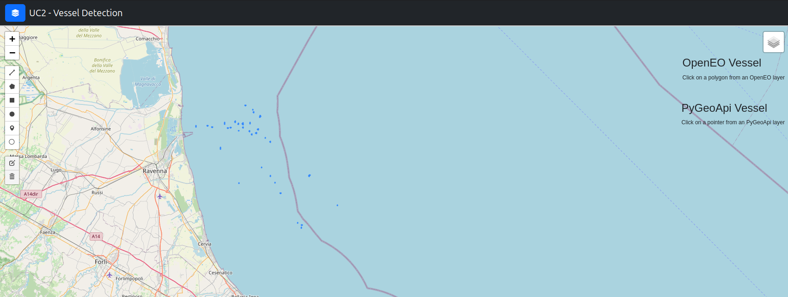

# Vessel Detection

In this notebook we will learn how to apply adaptive thresholding to SENTINEL1_GRD data within OpenEO Platform. We will then take a look at our results against vessel location data from the Maritime Traffic Agency over the Adriatic. We will be using the the openeo-python-client to prepare our process graph, and a Plotly Dash dashboard to interact with our results.

### Adaptive Thresholding in Xarray

After investigating the code initially provided by Planetek, we arrived at this xarray implementation of adaptive thresholding.

```python
WINDOW_LAT_SIZE = 30
WINDOW_LON_SIZE = 30
THRESHOLD_FACT = 4
out = xr.ones_like(data)
rolling_mean = data.rolling(
    longitude=WINDOW_LAT_SIZE, latitude=WINDOW_LON_SIZE, center=True
).mean()
thresholded_image = data > rolling_mean * THRESHOLD_FACT
raster = out.where(thresholded_image == True, other=0)
```

We are going to port this into an OpenEO process graph.

### 1. Authenticate


```python
import openeo

backend = "openeo.cloud"
conn = openeo.connect(backend)
conn = conn.authenticate_oidc()
```

### 2. Pre-processing prep

This process graph requires either a sea or land mask to remove the land from our AOI. A seamask has been prepared for this example and is available on github. It was derived using the [Water Bodies](https://land.copernicus.eu/content/corine-land-cover-nomenclature-guidelines/html/) classes from Corine Land Cover.


```python
import folium

# We are going to use the following GeoJson to operate as a sea mask for out process graph.
SEA_MASK = "https://raw.githubusercontent.com/SerRichard/sea_mask/main/sea-mask-4326.json"

fig = folium.Figure(width=600, height=400)
map = folium.Map(location=[44.465488, 12.602316], zoom_start=8)
folium.GeoJson(SEA_MASK).add_to(map)
fig.add_child(map)
```


### 3. Defining a process graph to detect vessels in our AOI.

The spatial_extent we have defined includes, but is not limited to the sea mask that we will be using. We will use both available polarizations from the SENTINEL1_GRD collection, and run this graph on a little over a weeks worth of data.


```python
spatial_extent  = {
          "west": 12.194377989297493,
          "east": 12.758093271633888,
          "south": 44.24420099164355,
          "north": 44.85455845353388
        }

temporal_extent = [
          "2021-10-01",
          "2021-10-09"
        ]

collection      = "SENTINEL1_GRD"
bands           = ["VV","VH"]

s1_datacube = conn.load_collection(
    collection,
    spatial_extent=spatial_extent,
    bands=bands,
    temporal_extent=temporal_extent
)
```

Load the geometries as a vector cube.


```python
sea_mask = s1_datacube.process("load_vector_cube", {"URL": SEA_MASK})
```

Replace the values that lie outside of our polygon with NaN values.


```python
masked_data = s1_datacube.mask_polygon(sea_mask)
```

To achieve the equivalent functionality of `data.rolling()`, we will use the process apply_kernel. The kernel will be the length and width of the window we want to apply the convolution to. The value of each pixel in the kernel is equal to `1/(kernel_width*kernel_height)`, spreading the weight evenly will achieve a mean for across the pixels in the kernel. The resut of the convolution is multiplied then multipled in the process by the factor value.


```python
kernel_value = 0.00104
kernel = [
    [
      kernel_value for y in range(0, 31)
    ] for x in range(0, 31)
]

applied_kernel = masked_data.apply_kernel(kernel=kernel,factor=5)
```


Next we want to compare the results of apply_kernel, against the values of the data we initially masked. We can use the process merge_cubes with the overlap resolver set to the less than process to acheive this.


```python
lt_comparison = applied_kernel.merge_cubes(
  masked_data, overlap_resolver="lt"
)
```

Convert the resulting boolean datacube to a vector cube, and output the result in save result as a GeoJson. This will make the comparison of our results with the Maritime traffic data more straight forward.


```python
output_data = lt_comparison.raster_to_vector()
```


```python
vessel_detection = output_data.save_result(format="GeoJSON")
```

### 4. Run Auxilliary job

You can optionally run the following job, if you would like to compare the original Sentinel1_GRD data, against the results from the vessel detection. This comparison makes it easier to visually validate the results, and spot erroneous polygons.

```
sentinel1_data = s1_datacube.save_result(format="GTiff")
sentinel1_data_job = sentinel1_data.create_job(title = "UC2-Auxilliary-Job")
sentinel1_data_job.start_job()
```

## Result Visualisation

A small dashboard has been provided with the Plotly Dash library to quickly visualise the results of our processing. We're using this dashboard so we can interface with the PyGeoApi server that hosts the Maritime Traffic data. You will need to use the canonical url of the job result, this can be found in the notebook via a helper fuinction, or in the job information via the web editor.

PyGeoApi Data: https://features.dev.services.eodc.eu/collections/adriatic_vessels


```python
from eodc.visualisation.vessel_detection.app import app
```


```python
app.run()
```
#### Plotly Dashboard for results viewing


With the additional auxilliary job


#### Use Case -- Recap

We've been through a number of iterations to arrive at this implementation.

1. Recieved an initial implementation from Planetek, which we packaged and released as a custom function, "vessel_detection". 
2. Porting to Xarray. This resulted in a single function called "adaptive_thresholding", that removed the dependency to the ellipsoid corrected SENTINEL1_GRD imagery.
3. Porting to existing OpenEO processes. This addresses the feedback from the previous review, i.e. the implementation should be reproducable for this use case.

